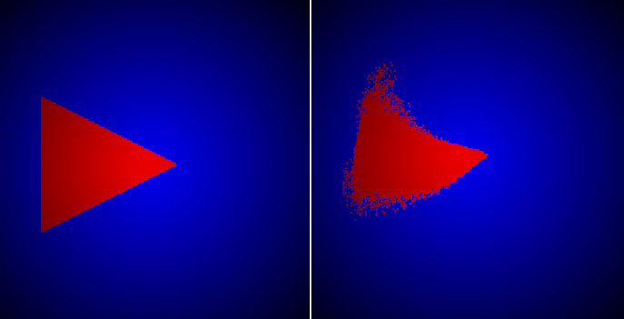
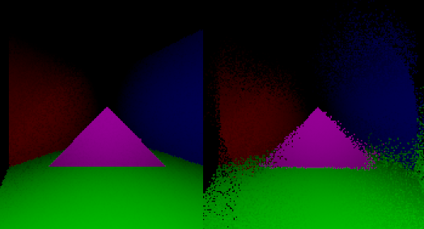
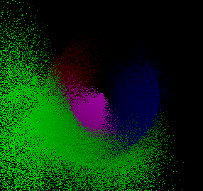

# slowlight
A C-based raycaster renderer in which every ray is not instantly calculated, but rather moves perceptibly slowly, thus making it easier to visualize interesting near-lightspeed geometrical distortions.

## Building

If you are on a Linux environment, run the `source buildtests.sh` command at the rood directory of the project.

On other environments, build each example individually with the `gcc -o build/<FILENAME>.<EXE/OUT/Your binary extension> tests/<FILENAME> src/slowlight.c src/slt.c external/gfx.c -g -lm -lX11` command.

for each example you want to build on other environments (though this was only tested on linux).

## Maths
This project uses basic vector operations. If you want to understand them better, I have attached a GeoGebra 3D file at the docs folder with which you can play around to get a more intuitive notion of what is going on ([Triangle_Subspace_Collision(1).ggb](./docs/Triangle_Subspace_Collision(1).ggb)).

There are wikipedia links at the maths-heavy parts of the code.

## History
Once I was bored and decided to spin around in my swivel chair. After stopping, I thought something like "Hey, were light to be slower, the background would keep spinning for a little longer, as it's farther away".

I decided to make a little raycaster to test whether that would really happen. I quickly figured the method I used is definitely not optimal, but as I had already spent a whole day making the raycaster, I decided to keep it.

One day and lots of workarounds later I could prove that yes, the background would keep spinning, and the closer objects would start spinning first when starting the rotation.

## Examples and observations

The simplest way to understand this project is by seeing it in action.

A good demonstration of what's going on is the triangle rotation example at `raster_test.c`.

When the triangle is rendered still, we can clearly see its triangular shape. When it's rotating counterclockwise, though, the parts of it that are farther away from the camera are updated less often, so we see a curve forming, where the inside of the triangle appears to be rotating "faster" than the outside.

This gets even more interesting when applied to more complex scenes.

Here the scene is rotating clockwise. We can see that the objects at the right side appear to be stretched out, while the opposite happens at the left side.

We can also verify the phenomenon I originally wanted to observe:

Here we see the beginning of a clockwise rotation. The green plane is closer to the camera, so it has already moved much further than the background.
When the rotation stops, indeed, the background keeps moving for a little while.

## Disclaimer
I don't guarantee the extraction of any kind of scientific data or meaning from the results of this project (or anything, really. Please refer to the [MIT License](./LICENCE) under which this project is distributed).

This project was built and is maintained by a single person, so there are probably bugs aplenty. If you have any suggestion, please open an Issue or e-mail me.

I hope this project brought you some interesting ideas or just a fun pastime.

^_^

\- Amélia